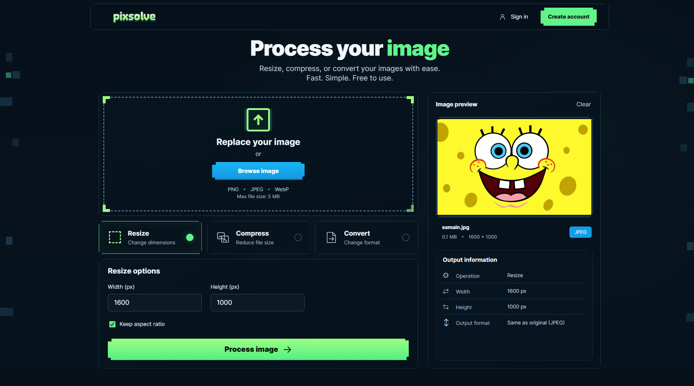
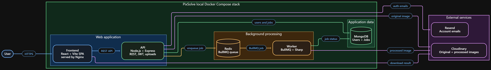
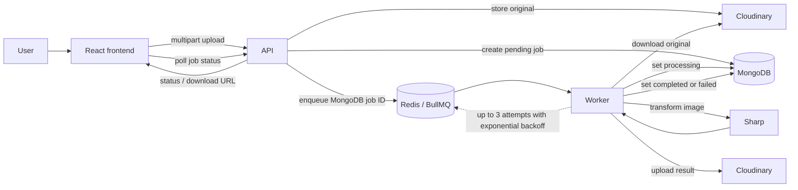

# PixSolve



PixSolve is a portfolio image-processing application built to demonstrate my backend engineering skills across REST APIs, authentication, file uploads, background processing, queues, image transformation, testing, Docker, API documentation, and deployment.

Users can upload one image, request a supported operation, follow the processing status, and download the completed result.

Accounts are optional: registered users gain authentication flows and Processing History, while guests can process and retrieve an individual job using a one-time access credential.

## V1 features

- Process one JPEG, PNG, or WebP image up to 5 MiB.
- Resize to a requested width and height.
- Compress JPEG, PNG, or WebP images with a quality setting.
- Convert images to JPEG, PNG, or WebP.
- Submit work asynchronously and track `pending`, `processing`, `completed`, or `failed` jobs.
- Use PixSolve as a guest or create an account for Processing History.
- Sign up, verify email, log in, reset a password, and update a password.
- Browse the API through Swagger UI or the committed OpenAPI 3.0.3 document.

## Live project and API documentation

- **Live project** : https://pixsolve.org
- **API documentation UI** : https://api.pixsolve.org/api/v1/docs
- **API documentation JSON** : https://api.pixsolve.org/api/v1/openapi.json
- **Repository OpenAPI document** : https://github.com/zmohamedmohsnz/pixsolve/blob/main/src/docs/openapi.json

## Technology overview

| Area | Technology | Purpose |
| --- | --- | --- |
| Frontend | React, Vite, React Router, Nginx | Browser interface for guest and account workflows |
| API | Node.js, Express, Zod | Versioned REST API, request validation, authentication, and job creation |
| Database | MongoDB, Mongoose | User and authoritative job records |
| Queue | Redis, BullMQ | Durable background-job queue and retry handling |
| Worker | Node.js, BullMQ, Sharp | Separate image-processing process |
| File storage | Cloudinary | Stores original and processed images |
| Email | Resend | Sends account verification and password-related emails |
| Containers | Docker, Docker Compose | Local five-service development stack |
| Production edge | Caddy | HTTPS reverse proxy for the production API |

## Architecture



The frontend calls the versioned API at `/api/v1`. The API and image-processing worker are separate Node.js processes. They share validated runtime configuration, connect to MongoDB and Redis, and communicate indirectly through the BullMQ queue.

In production, the React frontend is hosted by Vercel at `https://pixsolve.org`. Caddy exposes the API at `https://api.pixsolve.org`; the API, worker, and Redis run as separate Docker services on one VM at Oracle Cloud. MongoDB Atlas, Cloudinary, and Resend are external managed services.

### Job-processing lifecycle



1. The user selects one supported operation and uploads one image through the React frontend.
2. The API validates the multipart request and optional Bearer access token.
3. The API uploads the original image to Cloudinary, creates a `pending` job in MongoDB, and enqueues the MongoDB job ID in BullMQ.
4. The API returns `202 Accepted`. Guest creation also returns a one-time guest access token, which the frontend keeps out of the URL.
5. The separate worker receives the BullMQ job, changes its status to `processing`, downloads the original from Cloudinary, and applies Sharp.
6. The worker uploads the processed image to Cloudinary, then records the completed result in MongoDB. On its final unsuccessful attempt, it records a safe failure message instead.
7. The frontend polls the job endpoint until it reaches `completed` or `failed`. Registered users can also retrieve only their own jobs through Processing History.

BullMQ retries image-processing jobs up to three total attempts with exponential backoff. MongoDB remains the authoritative source for job status and history.

## Prerequisites

Install:

- [Node.js 22](https://nodejs.org/) and npm
- [Docker Desktop](https://www.docker.com/products/docker-desktop/) with Docker Compose v2
- A Cloudinary account and upload credentials
- A Resend API key and a verified sender email address

## Environment configuration

Create the backend environment file from the committed example:

```powershell
Copy-Item .env.example .env
```

Update the placeholder values in `.env`. Do not commit this file.

The backend environment variables are documented in [`.env.example`](.env.example):

- Runtime and browser origin: `NODE_ENV`, `PORT`, `PUBLIC_APP_URL`, `ALLOWED_ORIGINS`
- MongoDB and Redis: `DB_URI`, `REDIS_URL`
- Logging: `LOG_LEVEL`
- Cloudinary: `CLOUDINARY_CLOUD_NAME`, `CLOUDINARY_API_KEY`, `CLOUDINARY_API_SECRET`
- Resend: `RESEND_API_KEY`, `RESEND_FROM_EMAIL`
- Authentication: `EMAIL_VERIFICATION_TOKEN_LIFETIME_MINS`, `JWT_ACCESS_TOKEN_SECRET`, `JWT_ACCESS_TOKEN_LIFETIME_MINS`, `PASSWORD_RESET_TOKEN_LIFETIME_MINS`
- Authentication rate limiting: `AUTH_RATE_LIMIT_WINDOW_MINS`, `AUTH_RATE_LIMIT_MAX_REQUESTS`

For ordinary local frontend development, leave `VITE_API_BASE_URL` unset. Vite proxies `/api` requests to the local backend. The deployment-only frontend variable is documented in [`frontend/.env.example`](frontend/.env.example); it must include the `/api/v1` path when set.

## Local development

Install backend dependencies from the repository root:

```powershell
npm ci
```

Install frontend dependencies:

```powershell
npm ci --prefix frontend
```

Start MongoDB and Redis:

```powershell
docker compose up -d mongodb redis
```

Run the API and worker in separate terminals from the repository root:

```powershell
npm run dev
```

```powershell
npm run worker:dev
```

Run the frontend in another terminal:

```powershell
npm run dev --prefix frontend
```

Open [http://localhost:5173](http://localhost:5173).

The local process responsibilities are intentionally separate:

| Process | Command | Responsibility |
| --- | --- | --- |
| API | `npm run dev` | HTTP API, authentication, uploads, job creation, and job retrieval |
| Worker | `npm run worker:dev` | Consumes BullMQ jobs and performs Cloudinary/Sharp processing |
| Frontend | `npm run dev --prefix frontend` | Vite development server and browser interface |
| MongoDB and Redis | `docker compose up -d mongodb redis` | Local application data and queue infrastructure |

## Full Docker Compose workflow

The local Compose stack runs five services: `frontend`, `api`, `worker`, `mongodb`, and `redis`.

After creating and configuring `.env`, build and start the full stack:

```powershell
docker compose up --build
```

Use `Ctrl+C` to stop the foreground logs, or start it in the background:

```powershell
docker compose up --build -d
```

Open:

- Frontend: [http://localhost:8080](http://localhost:8080)
- API health check: [http://localhost:3000/health](http://localhost:3000/health)
- Local Swagger UI: [http://localhost:3000/api/v1/docs](http://localhost:3000/api/v1/docs)

Inspect service status and logs:

```powershell
docker compose ps
docker compose logs -f api
docker compose logs -f worker
```

Stop the stack while preserving the named MongoDB volume:

```powershell
docker compose down
```

## Tests and frontend build

Run the backend test suite from the repository root:

```powershell
npm test
```

Build the frontend production bundle:

```powershell
npm run build --prefix frontend
```

## V1 limitations

PixSolve V1 is intentionally scoped as a portfolio project.

- It supports one image per job; batch uploads are not included.
- Supported operations are resize, compression, and conversion only.
- Guests can retrieve only the individual job for which they received the one-time access token; guest jobs are not permanent Processing History entries.
- Processing History supports newest-first pagination only; it does not include search, tags, folders, favorites, analytics, or advanced filters.
- Authentication uses access tokens only; refresh tokens, social login, and two-factor authentication are out of scope.
- The worker processes one job at a time.
- File retention and cleanup policy are not defined in V1.
